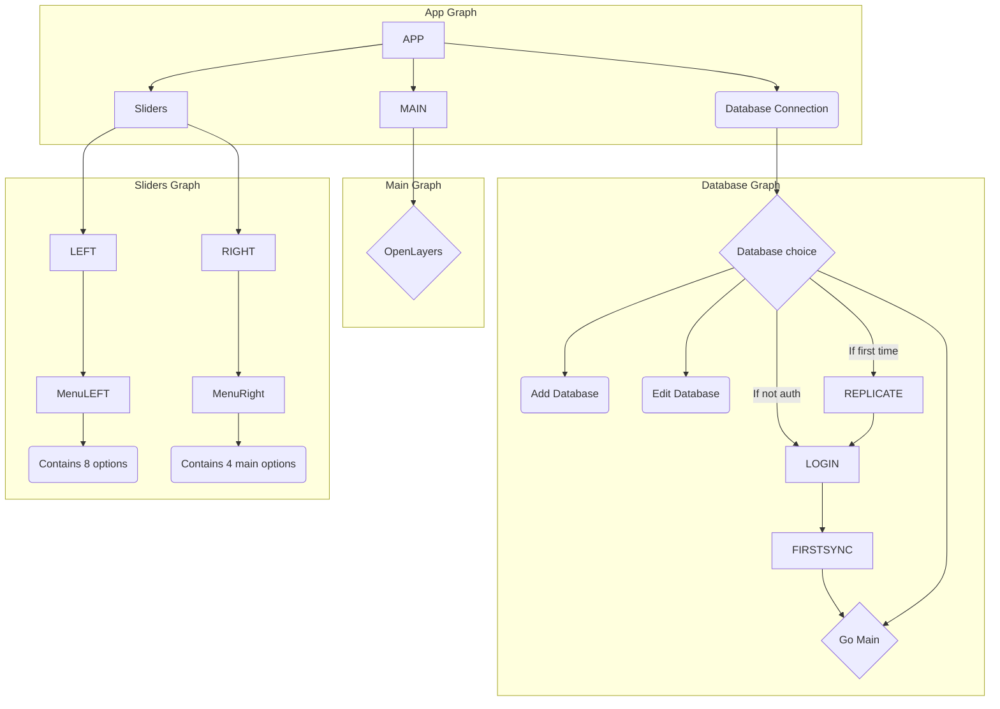

# SIRS Mobile

## 1 - Prerequisites

Clone this repository **with submodules**:
```
git clone https://gitlab.geomatys.com/geopatys-group/sirsmobilev2.git --recurse-submodules
```

Install **Android SDK** : http://developer.android.com/sdk/installing/index.html

Define **ANDROID_HOME** env variable in your ~/.bashrc:
```bash
export ANDROID_HOME=<path>/Android/Sdk
export ANDROID_SDK_ROOT=ANDROID_HOME
export PATH=${PATH}:$ANDROID_HOME/platform-tools
export PATH=${PATH}:$ANDROID_HOME/tools
```

Install **Gradle 6.5.1** :
```bash
curl -s "https://get.sdkman.io" | bash
sdk install gradle 6.5.1
```

Install **NodeJs 12.15.0** or greater

Install **Ionic 6.10.1** and **Cordova 9.0.0**:
```bash
npm install -g @ionic/cli@6.12.4
npm install -g cordova@9.0.0
```

## 2 - First installation

Run :

```bash
npm install
```

## 3 - Launch App on device

### Launch:

```bash
ionic cordova run android
```

### Troubleshooting:

### Reset platform Android

If you must remove the platform android for a reason (modified config.xml, updated plugins, etc.), do NOT manually add it.
Use run or build android command and let ionic create the platform folder it automatically.

#### Problem: Missing `cordova.variable.grable` file:
```
capacitor-cordova-android-plugins/cordova.variables.gradle' as it does not exist
```
__Solution:__ follow the first launch instructions.

#### Problem: `android.support.v4.content` does not exist
```
error: package android.support.v4.content does not exist
import android.support.v4.content.FileProvider;
```
__Solution:__ You should change every `android.support.v4.content.FileProvider` by
```java
androidx.core.content.FileProvider
```

#### Problem: Error fetch Android Ionic Project:

***if you find this error '(failed)net::ERR_CLEARTEXT_NOT_PERMITTED', ADD THIS***

***in config.xml, in plateform tag***
```xml
<edit-config file="app/src/main/AndroidManifest.xml" mode="merge" target="/manifest/application" xmlns:android="http://schemas.android.com/apk/res/android">
    <application android:networkSecurityConfig="@xml/network_security_config" android:usesCleartextTraffic="true" />
</edit-config>
```

***in android/app/src/main/AndroidManifest.xml, in plateform tag***
```
android:usesCleartextTraffic="true"
```

## 4 - Project images

<p align="center">
    </img>
    </img>
    </img>
</p>

## Project architecture


```mermaid
graph TB

    subgraph "App Graph"
    APP --> DB(Database Connection)
    APP --> MAIN
    APP --> Sliders
    end

    subgraph "Database Graph"
    DB --> DBChoice{Database choice}
    DBChoice --> ADD_DB(Add Database)
    DBChoice --> EDIT_DB(Edit Database)
    DBChoice --> |If not auth| LOGIN
    REPLICATE --> LOGIN
    DBChoice --> |If first time| REPLICATE
    LOGIN --> FIRSTSYNC
    FIRSTSYNC --> GoMain
    DBChoice --> GoMain{Go Main}
    end

    subgraph "Main Graph"
    MAIN --> OL{OpenLayers}
    end

    subgraph "Sliders Graph"
    Sliders --> LEFT
    Sliders --> RIGHT
    LEFT --> MenuLEFT
    RIGHT --> MenuRight

    MenuLEFT --> TMP1(Contains 8 options)

    MenuRight --> TMP2(Contains 4 main options)
end
```

## 5 - Continuous integration

The CI of this project is driven by `.gitlab-ci.yml` file.

It consists in three stages:

- build
- test
- sonarqube

the two first (build and test) are triggered on each push on master or any merge request.
The sonarqube stage is only triggered for push in master branch since we have only a single branch version of the software.

A `builder build` job (withing build stage) is triggered only if a `builder-v<X>.<Y>.<Z>` tag is added.
This will build a new "builder" docker image (cf. docker/builder/Dockerfile for more info) on `docker.geomatys.com`.

In order to change the version of the builder, edit the `BUILDER_VERSION` entry in CI/CD variables.

## 6 - Deployment
### Générer l'APK

Lignes de commande pour générer l'APK:

```
ionic cordova platform rm android
ionic cordova build android --release
$ANDROID_HOME/build-tools/31.0.0/zipalign -v 4 ./platforms/android/app/build/outputs/apk/release/app-release-unsigned.apk sirsmobile_<version>_<test/prod>.apk
$ANDROID_HOME/build-tools/31.0.0/apksigner sign --ks sirs-mobile.keystore --v1-signing-enabled true --v2-signing-enabled true sirsmobile_<version>_<test/prod>.apk
rm sirsmobile_304_test.apk.idsig
```
A ce stade un mot de passe est demandé, il se trouve dans l'item 'SirsMobile PlayStore' sur Bitwarden.

### Déployer sur Google Play Console

Une fois l'APK généré, naviguez jusqu'à la Console Google Play du compte Google sirsdigues@gmail.com (mdp sur Bitwarden, item: 'SirsMobile PlayStore').

Puis naviguez de la manière suivante: 'Toutes les applications' > 'Sirs Mobile Test Ionic 5' > Publier > Tests > Tests internes > 'Créer une release'.

Enfin suivre les indications du formulaire de création de release.

### Partager le lien de l'application (test uniquement)

Une fois l'APK déployée, il vous faut partager avec le client la nouvelle application.

Naviguez de la maniere suivante: Google Play Console > Tests > Tests internes > Testeurs.
Dans "Comment les testeurs rejoignent votre test" , cliquer sur "Copier le lien", envoyer le au client, il doit l'ouvrir sur un systeme Android, accepter l'invitation, puis cliquer sur "dowload it on Google Play" pour télécharger l'application.
