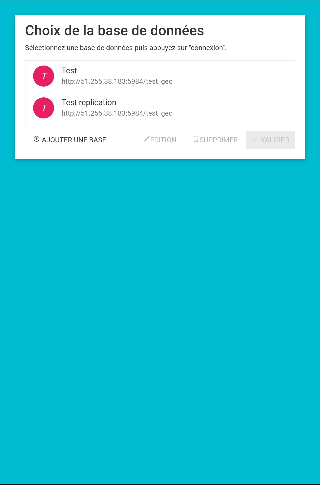
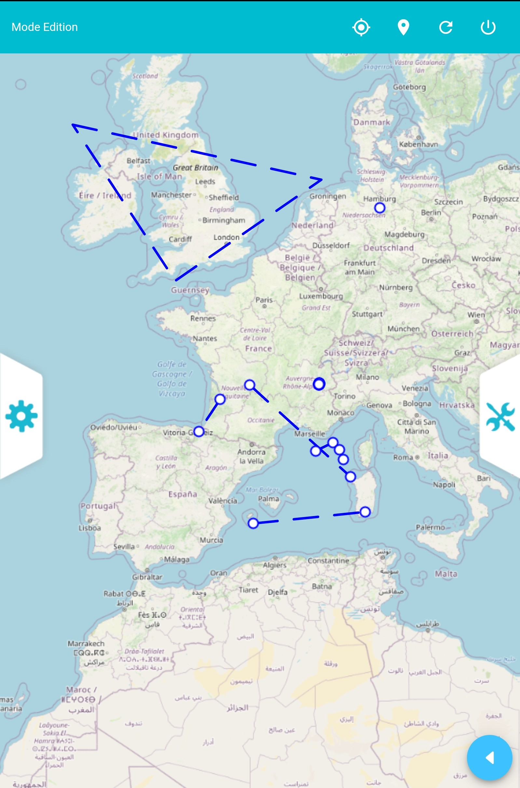
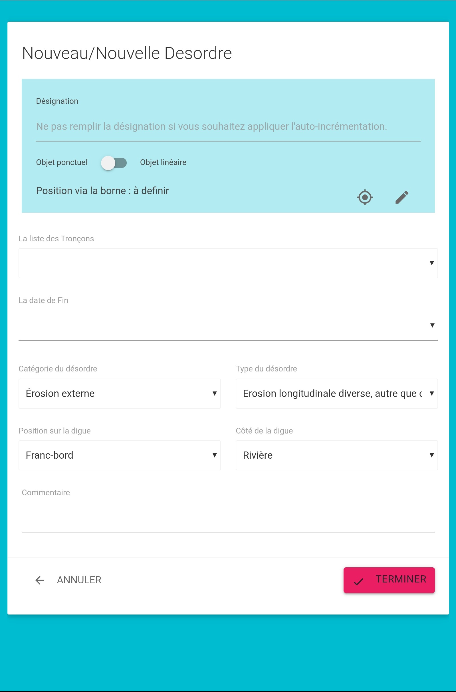
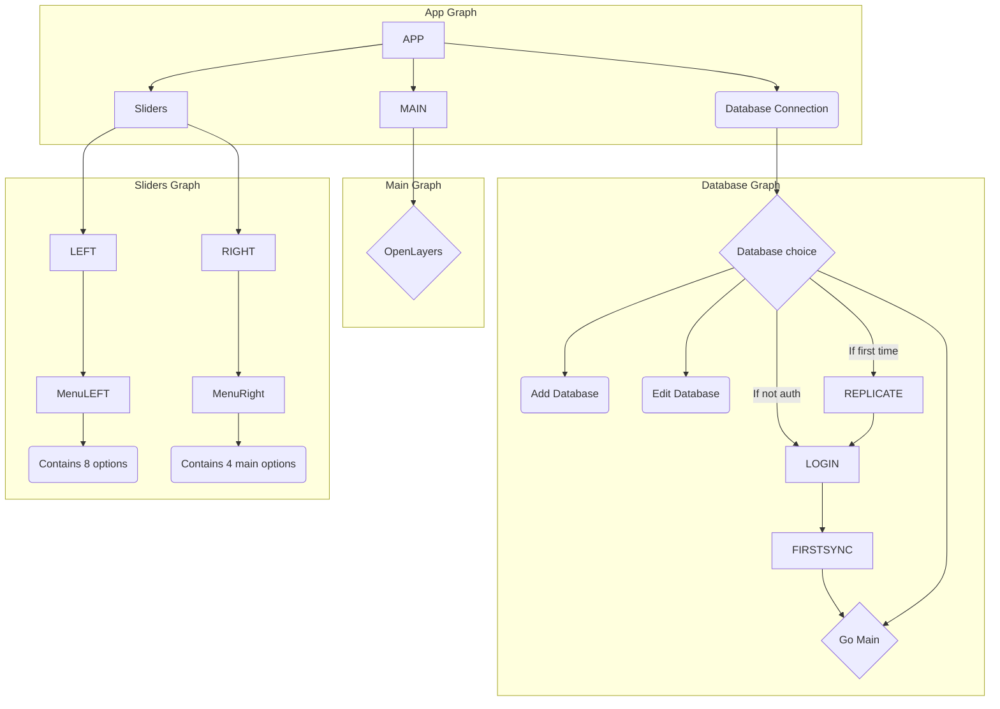

# SIRS Mobile

## Prerequisites

Clone this repository **with submodules**:
```
git clone https://gitlab.geomatys.com/geopatys-group/sirsmobilev2.git --recurse-submodules
```

Install **Android SDK** : http://developer.android.com/sdk/installing/index.html

Define **ANDROID_HOME** env variable :
```bash
export ANDROID_HOME=<Path_To_Sdk_Folder>
```
Update the **PATH** :
```bash
export PATH=${PATH}:<Path_To_Sdk_Folder>/platform-tools:<Path_To_Sdk_Folder>/tools
```
Install **Gradle 6.5.1** :
```bash
curl -s "https://get.sdkman.io" | bash
sdk install gradle 6.5.1
```

Install **NodeJs 12.15.0** or greater

Install **Ionic 6.10.1** and **Cordova 9.0.0**:
```bash
npm install -g ionic@6.10.1
npm install -g cordova@9.0.0
```

## First installation

Run :

```bash
npm install
```

## Launch App on device (using Capacitor)

### First launch:

<!> Under linux: replace ``` linuxAndroidStudioPath ``` value in  
 `capacitor.config.json` by the path of your ```studio.sh``` <!>

Setup cordova:

```bash
npx jetifier
ionic capacitor sync
ionic capacitor update
```

### Launch:

```bash
ionic capacitor run android
```

### Troubleshooting:

#### Problem: Missing `cordova.variable.grable` file:
```
capacitor-cordova-android-plugins/cordova.variables.gradle' as it does not exist
```
__Solution:__ follow the first launch instructions.

#### Problem: `android.support.v4.content` does not exist
```
error: package android.support.v4.content does not exist
import android.support.v4.content.FileProvider;
```
__Solution:__ You should change every `android.support.v4.content.FileProvider` by
```java
androidx.core.content.FileProvider
```

#### Problem: Error fetch Android Ionic Project:

***if you find this error '(failed)net::ERR_CLEARTEXT_NOT_PERMITTED', ADD THIS***

***in config.xml, in plateform tag***
```xml
<edit-config file="app/src/main/AndroidManifest.xml" mode="merge" target="/manifest/application" xmlns:android="http://schemas.android.com/apk/res/android">
    <application android:networkSecurityConfig="@xml/network_security_config" android:usesCleartextTraffic="true" />
</edit-config>
```

***in android/app/src/main/AndroidManifest.xml, in plateform tag***
```
android:usesCleartextTraffic="true"
```

## Project images

<p align="center">
    </img>
    </img>
    </img>
</p>

## Project architecture


```mermaid
graph TB

    subgraph "App Graph"
    APP --> DB(Database Connection)
    APP --> MAIN
    APP --> Sliders
    end

    subgraph "Database Graph"
    DB --> DBChoice{Database choice}
    DBChoice --> ADD_DB(Add Database)
    DBChoice --> EDIT_DB(Edit Database)
    DBChoice --> |If not auth| LOGIN
    REPLICATE --> LOGIN
    DBChoice --> |If first time| REPLICATE
    LOGIN --> FIRSTSYNC
    FIRSTSYNC --> GoMain
    DBChoice --> GoMain{Go Main}
    end

    subgraph "Main Graph"
    MAIN --> OL{OpenLayers}
    end

    subgraph "Sliders Graph"
    Sliders --> LEFT
    Sliders --> RIGHT
    LEFT --> MenuLEFT
    RIGHT --> MenuRight

    MenuLEFT --> TMP1(Contains 8 options)

    MenuRight --> TMP2(Contains 4 main options)
end
```
