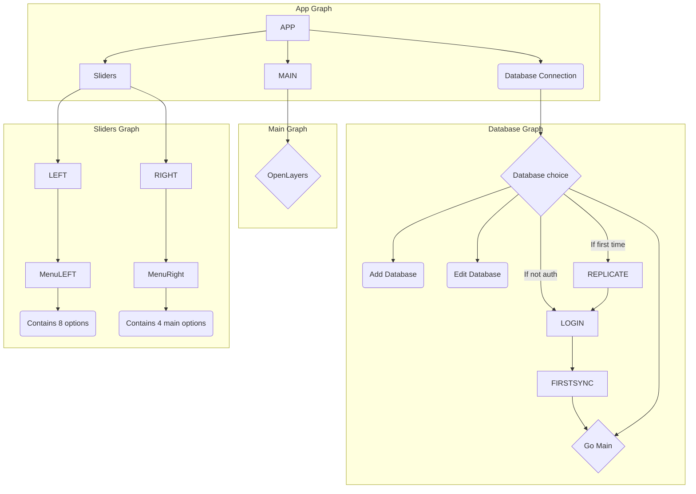

# SirsMobilev2

Reboot of the first hybrid mobile project with newer versions.

## Source code

Here is a [shortcut for source code](SirsMobile/src/app)

## Coverage

You can find the tests results in the [Coverage folder](SirsMobile/coverage/)

## Project architecture

```mermaid
graph TB

    subgraph "App Graph"
    APP --> DB(Database Connection)
    APP --> MAIN
    APP --> Sliders
    end

    subgraph "Database Graph"
    DB --> DBChoice{Database choice}
    DBChoice --> ADD_DB(Add Database)
    DBChoice --> EDIT_DB(Edit Database)
    DBChoice --> |If not auth| LOGIN
    REPLICATE --> LOGIN
    DBChoice --> |If first time| REPLICATE
    LOGIN --> FIRSTSYNC
    FIRSTSYNC --> GoMain
    DBChoice --> GoMain{Go Main}
    end

    subgraph "Main Graph"
    MAIN --> OL{OpenLayers}
    end

    subgraph "Sliders Graph"
    Sliders --> LEFT
    Sliders --> RIGHT
    LEFT --> MenuLEFT
    RIGHT --> MenuRight

    MenuLEFT --> TMP1(Contains 8 options)

    MenuRight --> TMP2(Contains 4 main options)
    


end
```
