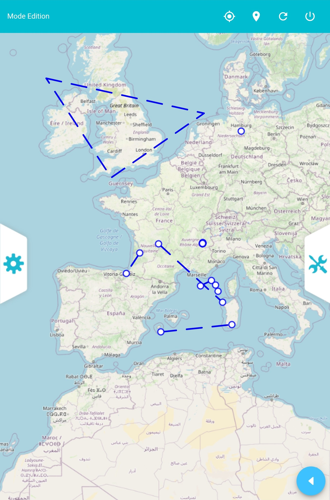

# SIRS Mobile

## 1 - Prerequisites

Clone this repository
```
git clone https://github.com/FranceDigues/sirsmobilev2.git
```

Install **Android SDK** : http://developer.android.com/sdk/installing/index.html

Define **ANDROID_HOME** env variable in your ~/.bashrc:
```bash
export ANDROID_HOME=<path>/Android/Sdk
export ANDROID_SDK_ROOT=ANDROID_HOME
export PATH=${PATH}:$ANDROID_HOME/platform-tools
export PATH=${PATH}:$ANDROID_HOME/tools
```

* Install **Gradle 6.5.1** :
```bash
curl -s "https://get.sdkman.io" | bash
sdk install gradle 6.5.1
```

* Install **NodeJs 16**

* JAVA 11

Install **Ionic 6.10.1** and **Cordova 9.0.0**:
```bash
npm install -g @ionic/cli@6.12.4
npm install -g cordova@9.0.0
npm install -g native-run
```

## 2 - First installation

Run :

```bash
npm install -f
```

## 3 - Launch App on device

### Launch:

```bash
ionic cordova run android
```

**Not forget to check the Troubleshooting section**

### Troubleshooting:

### Reset platform Android

If you must remove the platform android for a reason (modified config.xml, updated plugins, etc.), do NOT manually add it.
Use run or build android command and let ionic create the platform folder it automatically.

#### Problem: Missing `cordova.variable.grable` file:
```
capacitor-cordova-android-plugins/cordova.variables.gradle' as it does not exist
```
__Solution:__ follow the first launch instructions.

#### Problem: `android.support.v4.content` does not exist
```
error: package android.support.v4.content does not exist
import android.support.v4.content.FileProvider;
```
__Solution:__ You should change every `android.support.v4.content.FileProvider` by
```java
androidx.core.content.FileProvider
```

#### Problem: Error fetch Android Ionic Project:

***if you find this error '(failed)net::ERR_CLEARTEXT_NOT_PERMITTED', ADD THIS***

***in config.xml, in plateform tag***
```xml
<edit-config file="app/src/main/AndroidManifest.xml" mode="merge" target="/manifest/application" xmlns:android="http://schemas.android.com/apk/res/android">
    <application android:networkSecurityConfig="@xml/network_security_config" android:usesCleartextTraffic="true" />
</edit-config>
```

***in android/app/src/main/AndroidManifest.xml, in plateform tag***
```
android:usesCleartextTraffic="true"
```

### Problem with cordova-camera permissions with old android versions

If you have problems with old android version with camera plugin for permissions like `READ_EXTERNAL_STORAGE` or `WRITE_EXTERNAL_STORAGE` you can add inside the `<manifest>` tag of the generated file `platforms/android/app/src/main/AndroidManifest.xml` the following lines in :

```
 <uses-permission android:maxSdkVersion="32" android:name="android.permission.CAMERA" />
 <uses-permission android:maxSdkVersion="32" android:name="android.permission.READ_EXTERNAL_STORAGE" />
 <uses-permission android:maxSdkVersion="32" android:name="android.permission.WRITE_EXTERNAL_STORAGE" />
```

And retry to build and run the application

## 4 - Project images

<p align="center">
    </img>
    </img>
    </img>
</p>

## Project architecture


## 6 - Deployment
### Générer l'AAB

Lignes de commande pour générer l'AAB:

```
ionic cordova platform rm android

ionic cordova build android --release -- -- --packageType=bundle

$ANDROID_HOME/build-tools/32.0.0/zipalign -v 4 ./platforms/android/app/build/outputs/bundle/release/app-release.aab sirsmobile_<version>_<test/prod>.aab
```


### Générer l'APK

Lignes de commande pour générer l'APK:

```
ionic cordova platform rm android

ionic cordova build android --release -- -- --packageType=apk

$ANDROID_HOME/build-tools/33.0.2/zipalign -v 4 ./platforms/android/app/build/outputs/apk/release/app-release-unsigned.apk sirsmobile_<version>_<test/prod>.apk
```
